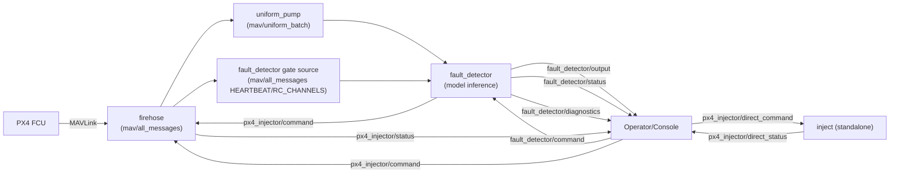

# Confluence Knowledge Base

This document is the full technical reference for the Confluence ROS2 package.

It is intentionally exhaustive and covers:
- architecture and runtime data flow
- ROS topics, payload contracts, and command schemas
- all CLIs and launch patterns
- module-by-module code map
- fault detection/fix semantics
- environment configuration precedence
- debugging, validation, and extension guidance

---

## 1. System Purpose

Confluence is a ROS2-based PX4 companion stack with five primary responsibilities:
- ingest high-rate MAVLink traffic (`firehose`)
- transform asynchronous raw telemetry into model-ready windows (`uniform_pump`)
- run fault inference and command recovery/fix logic (`fault_detector`)
- execute parameter writes with readback verification (`firehose` injector backend and standalone `inject`)
- orchestrate the full stack and provide a remote operator console (`orchestrator` + `Console/console.py`)

Core design goals:
- deterministic and inspectable behavior in flight
- guardrails around in-flight writes (defer if armed when configured)
- explicit diagnostics for every critical state transition
- compatibility with working `waterfall_local` behavior where it matters (gating + model timing semantics)

---

## 2. Repository Structure

```
Confluence/
├── Console/
│   └── console.py
├── Device/
│   ├── .drone-env
│   ├── confluence/
│   │   ├── firehose.py
│   │   ├── uniform_pump.py
│   │   ├── fault_detector.py
│   │   ├── inject.py
│   │   ├── orchestrator.py
│   │   ├── hooks/
│   │   │   ├── fault_hook.py
│   │   │   └── fault_detector_probe.py
│   │   ├── models/
│   │   │   ├── models.py
│   │   │   ├── classifier_1ts.ckpt
│   │   │   └── classifier_3ts.ckpt
│   │   └── utils/
│   │       └── param_injection.py
│   ├── package.xml
│   ├── setup.py
│   └── setup.cfg
├── UI/
│   ├── package.json
│   ├── vite.config.js
│   ├── dashboard_server.py
│   ├── src/
│   │   ├── main.js
│   │   └── styles.css
│   ├── static/
│   │   ├── index.html
│   │   └── assets/
│   │       ├── app.css
│   │       └── app.js
│   └── tests/
│       └── test_dashboard_server.py
├── README.md
└── knowledgebase.md
```

### Module index

| File | Purpose |
|---|---|
| `Device/confluence/firehose.py` | MAVLink connection + raw message publisher + primary parameter write backend |
| `Device/confluence/uniform_pump.py` | Time-window builder for model input (`raw`, `single_step`, `multi_step`) |
| `Device/confluence/fault_detector.py` | Model inference, flight gate logic, fault latching, post-landing fix application |
| `Device/confluence/inject.py` | Standalone direct injector for explicit write commands |
| `Device/confluence/orchestrator.py` | Process supervisor + local multiplexer + TCP command bridge |
| `Console/console.py` | User-facing remote CLI client for orchestrator TCP bridge |
| `Device/confluence/hooks/fault_hook.py` | One-shot local param injection or remote fault command utility |
| `Device/confluence/hooks/fault_detector_probe.py` | Integration probe for detector command/status/diagnostic paths |
| `Device/confluence/utils/param_injection.py` | Shared MAVLink PARAM_SET/PARAM_VALUE encode/decode + env resolution helpers |
| `Device/confluence/models/models.py` | Model class (`NN_classifier`) used by detector |
| `UI/dashboard_server.py` | Read-only browser dashboard bridge and state reducer |
| `UI/static/*` | Dashboard frontend (3-column status/details/telemetry UI) |

---

## 3. Architecture



### Control plane vs data plane

- Data plane:
  - `mav/all_messages` (raw MAVLink JSON)
  - `mav/uniform_batch` (windowed model input)
  - `fault_detector/output` (model and forced fault outputs)
- Control plane:
  - `fault_detector/command`
  - `px4_injector/command`
  - `px4_injector/direct_command`
- Observability plane:
  - `fault_detector/status`
  - `fault_detector/diagnostics`
  - `px4_injector/status`
  - `px4_injector/direct_status`

---

## 4. Runtime Build and Launch

## 4.1 Build

```bash
cd /Users/abm/XVOL/Cornell/MAGPIE/Confluence
colcon build --symlink-install --paths Device --packages-select confluence
source install/setup.bash
```

## 4.2 Standard launch

```bash
ros2 run confluence orchestrator --all --env-file Device/.drone-env
```

Expected services:
- `firehose`
- `uniform_pump`
- `inject`
- `fault_detector`

## 4.3 Remote console launch

```bash
uv run Console/console.py --host <DRONE_IP> --port 9000
```

Rich-formatted variant:
```bash
uv run --with rich Console/console.py --host <DRONE_IP> --port 9000
```

Local-only (if running console on same machine as orchestrator):
```bash
uv run Console/console.py
```

## 4.4 Demo UI launch

Build UI assets (npm):
```bash
cd /Users/abm/XVOL/Cornell/MAGPIE/Confluence/UI
npm install
npm run build
cd ..
```

```bash
uv run UI/dashboard_server.py --orchestrator-host <DRONE_IP> --orchestrator-port 9000 --ui-host 127.0.0.1 --ui-port 8765
```

Open `http://127.0.0.1:8765` in a browser.

---

## 5. Environment and Configuration (`Device/.drone-env`)

`Device/.drone-env` is used by:
- `orchestrator`
- `inject`
- `fault_hook`

Current defaults in repository:

```bash
CONFLUENCE_MAVLINK_CONNECTION=/dev/ttyTHS3
CONFLUENCE_MAVLINK_BAUD=115200
CONFLUENCE_MAVSDK_ADDRESS=serial:///dev/ttyTHS3:115200
CONFLUENCE_PARAM_TIMEOUT=5.0

CONFLUENCE_FAULT_PARAM=PWM_MAIN_FUNC3
CONFLUENCE_FAULT_VALUE=0

CONFLUENCE_FIREHOSE_ARGS="--serial-port /dev/ttyTHS3 --serial-baud 115200"
CONFLUENCE_UNIFORM_PUMP_ARGS="--ros-args -p condensation_mode:=multi_step -p multi_step_count:=5"
CONFLUENCE_INJECT_ARGS=""
CONFLUENCE_FAULT_DETECTOR_ARGS="--ros-args -p publish_inject_command:=false -p require_flight_gate:=true -p hold_model_fault_until_landing:=true -p auto_apply_model_fix_after_landing:=true -p model_confidence_threshold:=0.0 -p model_vote_window:=1 -p model_vote_required:=1 -p enable_diagnostics:=true -p diagnostics_every_n:=5"
CONFLUENCE_CONSOLE_HOST=0.0.0.0
CONFLUENCE_CONSOLE_PORT=9000
CONFLUENCE_CONSOLE_STREAM_LOGS=false
```

### Resolution behavior

- Runtime lookup logic still checks relative defaults such as `./.drone-env` and `./src/confluence/.drone-env`.
- In this repository layout, the env file is stored at `Device/.drone-env`, so use `--env-file Device/.drone-env` when launching from repo root.
- `param_injection.load_env_file()` follows equivalent relative fallback behavior.

### Effective precedence

General rule:
1. explicit CLI argument
2. env-file value
3. hardcoded default

---

## 6. ROS Topic Catalog (Complete)

## 6.1 Producers and consumers

| Topic | Type | Producer | Consumer(s) | Purpose |
|---|---|---|---|---|
| `mav/all_messages` | `std_msgs/msg/String` | `firehose` | `uniform_pump`, `fault_detector` (gate source) | Raw MAVLink JSON stream |
| `mav/raw/bytes` | `std_msgs/msg/UInt8MultiArray` | `firehose` (optional) | optional tools | Raw MAVLink bytes |
| `mav/uniform_batch` | `std_msgs/msg/String` | `uniform_pump` | `fault_detector` | Windowed model input |
| `fault_detector/output` | `std_msgs/msg/String` | `fault_detector` | console/watchers, probes | Fault result stream (model and forced) |
| `fault_detector/status` | `std_msgs/msg/String` | `fault_detector` | console/watchers, probes | State/status events |
| `fault_detector/diagnostics` | `std_msgs/msg/String` | `fault_detector` | console/watchers, probes | Deep diagnostics and snapshots |
| `fault_detector/command` | `std_msgs/msg/String` | console/orchestrator/probes | `fault_detector` | Fault command API |
| `px4_injector/command` | `std_msgs/msg/String` | `fault_detector`, console/orchestrator | `firehose` | Primary param write path |
| `px4_injector/status` | `std_msgs/msg/String` | `firehose` | console/watchers/probes | Write result + verification details |
| `px4_injector/direct_command` | `std_msgs/msg/String` | external users | `inject` | Standalone direct write path |
| `px4_injector/direct_status` | `std_msgs/msg/String` | `inject` | external users | Standalone direct write status |

---

## 7. Payload Schemas

All control/status topics in this stack carry JSON strings in `std_msgs/msg/String.data`.

## 7.1 `mav/all_messages`

`firehose` publishes one MAVLink message per packet as JSON object with:
- native MAVLink fields from `msg.to_dict()`
- `_msg_type` (string, MAVLink type name)
- `_timestamp` (float, Unix seconds)

Example:
```json
{
  "base_mode": 81,
  "custom_mode": 0,
  "system_status": 3,
  "type": 2,
  "autopilot": 12,
  "_msg_type": "HEARTBEAT",
  "_timestamp": 1771453564.8883862
}
```

## 7.2 `mav/uniform_batch`

Top-level:
- `data` (object of message families)
- `_batch_metadata` (batch diagnostics)

`_batch_metadata` fields:
- `batch_number`
- `batch_start_time`
- `batch_end_time`
- `batch_interval`
- `condensation_mode`
- `message_types_count`
- `total_messages_in_batch`

In `multi_step` mode:
- `data.<family>` is list length `multi_step_count`
- `data.timestamps` is list length `multi_step_count`

## 7.3 `fault_detector/output`

### Model output shape
```json
{
  "fault": true,
  "fault_label": "motor 3 malfunction",
  "parameters": {"PWM_MAIN_FUNC2": 103},
  "timestamp": 1771454415.390457,
  "source": "model",
  "raw_pred": 3,
  "stable_pred": 3,
  "confidence": 0.2314
}
```

### Forced output shape
```json
{
  "fault": true,
  "fault_label": "motor 1 malfunction",
  "parameters": {"PWM_MAIN_FUNC4": 0},
  "timestamp": 1771454298.6779025,
  "forced": true,
  "source": "forced",
  "apply_inject": true
}
```

## 7.4 `fault_detector/status`

Canonical fields:
- `source`: one of `model`, `forced`, `flight_gate`, `model_fix`
- `fault`: boolean
- `fault_label`: label string
- `timestamp`: float

Optional fields by source:
- model: `confidence`, `raw_pred`, `stable_pred`
- flight_gate: `gate_open`, `armed`, `throttle`, `throttle_up`, `gate_source`
- model_fix: `fix_applied`, `label`, `params`

## 7.5 `fault_detector/diagnostics`

Always includes:
- `event`
- `timestamp`
- `source` (`fault_detector`)
- `batches_received`
- `inferences_run`

Plus dynamic fields. Current event families:
- `flight_gate_state`
- `model_fault_latched`
- `model_fix_applied_after_landing`
- `batch_skipped`
- `inference_skipped`
- `inference`
- `probe_result`
- `clear_restore_published`
- `error`

Snapshot-style fields commonly included:
- `model_loaded`
- `forced_fault_active`
- `last_data_keys`
- `last_step_indices`
- `last_feature_len`
- `last_pred_raw`
- `last_pred_stable`
- `last_confidence`
- `last_fault_label`
- `last_inference_ts`
- `armed`
- `throttle`
- `throttle_up`
- `flight_gate_open`
- `model_fault_latched`
- `pending_model_fix`

## 7.6 `px4_injector/status` (from `firehose`)

Shape:
```json
{
  "action": "set_params",
  "results": {"PWM_MAIN_FUNC4": true},
  "details": {
    "PWM_MAIN_FUNC4": {
      "ok": true,
      "actual": 101
    }
  },
  "source": "fault_detector_clear",
  "queued": false,
  "armed": false
}
```

`details.<param>.reason` may include:
- `not_connected`
- `no_response`
- `mismatch`
- `timeout`
- exception text
- `deferred_until_disarmed` (queueing path context)

## 7.7 `px4_injector/direct_status` (from standalone `inject`)

Shape:
```json
{
  "action": "set_params",
  "results": {"PWM_MAIN_FUNC4": true},
  "details": {
    "PWM_MAIN_FUNC4": {
      "ok": true,
      "actual": 101
    }
  },
  "source": "inject"
}
```

`direct_status` does not include queue/defer fields because standalone `inject` executes immediately.

---

## 8. Command Schemas (Control API)

## 8.1 `fault_detector/command`

### Probe
```json
{"action":"run_probe","probe_id":123}
```

### Forced fault
```json
{"action":"inject_fault","fault_index":1}
```

or explicit payload:
```json
{"action":"inject_fault","fault_label":"motor 1 malfunction","params":{"PWM_MAIN_FUNC4":0}}
```

Optional:
- `apply_inject` (bool, default true)

### Clear
```json
{"action":"clear_fault"}
```

Options:
- `restore` (default from node config)
- `defer_until_disarmed` (default from node config)
- `restore_params` object override

## 8.2 `px4_injector/command` and `px4_injector/direct_command`

```json
{"action":"set_params","params":{"PWM_MAIN_FUNC4":101}}
```

Optional:
- `source`
- `defer_until_disarmed`

Single-param shorthand accepted by backend:
```json
{"action":"set_params","param":"PWM_MAIN_FUNC4","value":101}
```

---

## 9. Service Deep Dive

## 9.1 `firehose`

### Responsibilities
- create MAVLink connection (serial or SITL UDP)
- request stream data rate
- publish raw JSON packets to ROS
- optionally publish raw bytes
- execute and verify parameter writes
- queue deferred writes while armed (if requested)

### ROS parameters
- `use_sitl` (bool)
- `connection_string` (string)
- `serial_port` (string)
- `serial_baud` (int)
- `sitl_address` (string)
- `data_stream_rate` (int)
- `publish_raw_bytes` (bool)
- `topic_all_messages` (string)
- `topic_raw_bytes` (string)
- `inject_command_topic` (string)
- `inject_status_topic` (string)

### CLI flags
- `--sitl`
- `--connection`
- `--serial-port`
- `--serial-baud`
- `--stream-rate`
- `--no-raw-bytes`

### Key implementation notes
- write verification uses PARAM_SET then PARAM_REQUEST_READ and compares decoded value
- for float writes: tolerance check `abs(actual-target) < 1e-4`
- errors are log-rate-limited to reduce flood (`suppressed` count)

## 9.2 `uniform_pump`

### Responsibilities
- collect incoming raw MAVLink JSON by message family
- maintain short historical bleeding domain per family
- emit fixed-interval batches for model consumption

### Condensation modes
- `raw`: pass full message lists
- `single_step`: average numeric fields to one message per family
- `multi_step`: temporal window with `multi_step_count` steps

### Multi-step strategies
- `nearest` (default): choose nearest sample to each anchor timestamp (waterfall-compatible)
- `bucket_average`: divide interval into buckets and average each bucket

### ROS parameters
- `batch_interval` (float)
- `condensation_mode` (`raw`/`single_step`/`multi_step`)
- `multi_step_count` (int)
- `multi_step_strategy` (`nearest`/`bucket_average`)
- `bleeding_domain_duration` (float)
- `missing_data_strategy` (`bleeding_average`/`bleeding_latest`/`null`/`zero`)
- `input_topic`
- `output_topic`

### Message family aliases
Mapped from raw MAVLink `_msg_type`:
- `ATTITUDE` -> `attitude`
- `ATTITUDE_QUATERNION` -> `attitude_quat`
- `RC_CHANNELS` -> `rc_channels`
- `SERVO_OUTPUT_RAW` -> `servo_output`
- `RAW_IMU`/`HIGHRES_IMU`/`SCALED_IMU` -> `imu`
- `LOCAL_POSITION_NED` -> `local_pos`
- `GLOBAL_POSITION_INT` -> `global_pos`
- `VFR_HUD` -> `velocity`
- `ODOMETRY` -> `odometry`
- `SCALED_PRESSURE` -> `pressure`
- `SYS_STATUS` -> `sys_status`
- `HEARTBEAT` -> `heartbeat`

## 9.3 `fault_detector`

### Responsibilities
- deserialize `mav/uniform_batch`
- build fixed-length feature vector
- run model inference
- publish model outputs/status/diagnostics
- manage forced-fault command path
- gate inference by flight state
- latch model faults in flight and apply fix after landing if configured

### Flight gate
Gate uses:
- arm state from HEARTBEAT `base_mode` armed bit
- throttle from RC channel (default channel 3)
- threshold (default 1100)

Gate source behavior:
- primary: raw `mav/all_messages` via `_gate_callback`
- fallback: batch extraction when raw updates stale (>2s)

### Inference stabilization
- confidence threshold (`model_confidence_threshold`)
- vote history window (`model_vote_window`)
- votes required (`model_vote_required`)

Current production defaults are waterfall-style:
- threshold `0.0`
- vote window `1`
- votes required `1`

### Mapping (model-based fixes)
- `motor 1 malfunction` -> `PWM_MAIN_FUNC4=101`
- `motor 2 malfunction` -> `PWM_MAIN_FUNC1=102`
- `motor 3 malfunction` -> `PWM_MAIN_FUNC2=103`
- `motor 4 malfunction` -> `PWM_MAIN_FUNC3=104`

### Mapping (forced fault injection)
- `fault 1` -> `PWM_MAIN_FUNC4=0`
- `fault 2` -> `PWM_MAIN_FUNC1=0`
- `fault 3` -> `PWM_MAIN_FUNC2=0`
- `fault 4` -> `PWM_MAIN_FUNC3=0`

### Feature vector contract
For `classifier_3ts.ckpt`:
- expected `input_layer=81`
- labels: `attitude`, `attitude_quat`, `rc_channels`, `servo_output`, `timestamps`
- effective feature layout per step:
  - attitude: 6 values (`roll`, `pitch`, `yaw`, `rollspeed`, `pitchspeed`, `yawspeed`)
  - quat: 4 values (`q1..q4` or orientation `wxyz`)
  - rc: 8 values normalized `(x-1000)/(2400-1000)`
  - servo: 8 values normalized `(x-0)/(1000-0)`
  - timestamp delta: 1 value relative to first step

Total per step: 27; over 3 steps: 81.

### Fault latch behavior
If `hold_model_fault_until_landing=true`:
- first detected model fault is latched
- detector skips further model action while latched
- on gate close/disarm condition and if `auto_apply_model_fix_after_landing=true`, publishes param fix to injector

### Clear behavior
`clear_fault`:
- clears forced fault state
- clears model latch and pending fix
- optionally restores configured params
- restore can be deferred until disarmed

## 9.4 `inject`

### Responsibilities
- standalone parameter injector
- subscribes to `px4_injector/direct_command`
- executes writes with shared `ParamInjectorClient`
- publishes `px4_injector/direct_status`

### Notes
- uses same low-level encode/decode/verify logic as other injection paths
- closes serial client after each command to reduce long-lived port contention

## 9.5 `orchestrator`

### Responsibilities
- start/stop service subprocesses
- multiplex service output in one terminal
- attach/detach IO to a specific service
- host TCP console bridge
- proxy remote commands into ROS2 topics

### Local interactive commands
- `list`
- `attach <service>` or service name directly
- `help`
- `quit`

### Remote TCP command set
- `list`
- `probe`
- `fault <1-4>`
- `clear` / `clear no-restore` / `clear now` / `clear now no-restore`
- `inject PARAM=VALUE ...`
- `watch <topic> <type>`
- `unwatch <topic>`
- `pub <topic> <type> <json>`

### Orchestrator CLI flags
- `--all`
- `--services`
- `--env-file`
- `--firehose-args`
- `--uniform-pump-args`
- `--inject-args`
- `--fault-detector-args`
- `--log-file`
- `--console-host`
- `--console-port`
- `--console-stream-logs`
- `--no-console-stream-logs`

### Console streaming note
By default, service log lines are **not** streamed to remote clients (`CONFLUENCE_CONSOLE_STREAM_LOGS=false`) to avoid interactive CLI disruption/noise.

## 9.6 `Console/console.py`

### User commands
- `help`
- `list`
- `probe`
- `fault <index>`
- `clear`
- `clear no-restore`
- `clear now`
- `clear now no-restore`
- `inject PARAM=VALUE ...`
- `watch <topic> <type>`
- `unwatch <topic>`
- `pub <topic> <type> <json>`
- `quit`

### Behavior
- displays async log/topic/event messages while keeping prompt usable
- auto-uses Rich formatting if `rich` is available (or force with `--rich`)
- supports `--plain` to disable Rich styling and use minimal output
- exits cleanly on `Ctrl-C` or `quit`

## 9.7 Hooks

### `fault_hook`
Modes:
- `local`: one-shot param set+verify against PX4
- `remote`: send `fault` command to orchestrator TCP server

### `fault_detector_probe`
Purpose:
- integration probe for command routing + detector status + injector status

Checks:
- detector receives batches
- inference path has run at least once
- feature length matches expected model input
- forced fault publish path
- clear path
- optional injector status observations

## 9.8 `UI/dashboard_server.py` (demo dashboard)

### Responsibilities
- connect to orchestrator TCP console bridge as a read-only client
- subscribe via `watch` commands to:
  - `fault_detector/output`
  - `fault_detector/status`
  - `fault_detector/diagnostics`
  - `px4_injector/status`
  - `mav/all_messages`
- derive a 3-state demo UI timeline:
  - `operational`
  - `fault_detected`
  - `fault_fixing`
- serve local HTTP endpoints:
  - `/` (dashboard frontend)
  - `/api/state` (derived snapshot)
  - `/health` (bridge/server health)

### Status derivation semantics
- `fault_detector/output` with `fault=true` => enter `fault_detected`
- `px4_injector/status` with `source` starting `fault_detector` => enter `fault_fixing`
- `fault_fixing` is intentionally held for `fix_duration_sec` (default 5s) for demo visibility
- after timer expiry => return `operational`

### Notes
- UI is intentionally non-interactive for safety; no write/inject actions are exposed.
- Data source is live orchestrator stream only (no synthetic fallback).
- Frontend is built locally with npm (`Vite`) from `UI/src/*` into `UI/static/*`.
- Backend bridge remains local-only Python stdlib HTTP/socket stack.
- Header includes a light/dark theme toggle with local persistence.

---

## 10. CLI Reference (All Executables)

From `Device/setup.py` entry points:
- `ros2 run confluence firehose`
- `ros2 run confluence uniform_pump`
- `ros2 run confluence inject`
- `ros2 run confluence fault_detector`
- `ros2 run confluence orchestrator`
- `ros2 run confluence fault_hook`
- `ros2 run confluence fault_detector_probe`
- `ros2 run confluence monolithic_fault` (alias to `fault_hook`)

Additional local executable:
- `uv run UI/dashboard_server.py` (demo web dashboard)

---

## 11. Operational Playbooks

## 11.1 Standard run (drone)

```bash
cd /Users/abm/XVOL/Cornell/MAGPIE/Confluence
colcon build --symlink-install --paths Device --packages-select confluence
source install/setup.bash
ros2 run confluence orchestrator --all --env-file Device/.drone-env
```

## 11.2 Standard operator sequence

```text
# connect console first
list
watch fault_detector/output std_msgs/msg/String
watch fault_detector/diagnostics std_msgs/msg/String
watch px4_injector/status std_msgs/msg/String

# inject and clear
fault 1
clear
```

Optional demo UI in parallel:
```bash
uv run UI/dashboard_server.py --orchestrator-host 127.0.0.1 --orchestrator-port 9000 --ui-host 127.0.0.1 --ui-port 8765
```

## 11.3 Parameter-only emergency recovery

```text
inject PWM_MAIN_FUNC4=101 PWM_MAIN_FUNC1=102 PWM_MAIN_FUNC2=103 PWM_MAIN_FUNC3=104
```

## 11.4 Verify detector command path only

```bash
ros2 run confluence fault_detector_probe --probe-only
```

---

## 12. Troubleshooting Matrix

| Symptom | Likely cause | What to check | Action |
|---|---|---|---|
| Console `ConnectionRefusedError` | orchestrator not listening | orchestrator startup output | restart orchestrator, verify host/port |
| Repeated firehose serial read warnings | serial contention | other MAVLink clients/QGC using same port | close competing process or split endpoints |
| Fault detector exits/crashes | runtime exception | `fault_detector` logs | fix offending code path, rebuild, relaunch |
| No model detections ever | gate never opens or model config not loaded | `fault_detector` gate logs + stabilization line | arm + throttle-up, ensure `--env-file Device/.drone-env` (or equivalent) is used |
| Fault published but no physical effect | injector write failed/deferred | `px4_injector/status` `details` | disarm if deferred; resolve mismatch/timeout |
| Clear acknowledged but craft still not restored | restore deferred while armed or param reject | `fault_detector` clear logs + injector status | disarm, then verify restore command results |
| Wrong motor label appears often | model domain mismatch / telemetry distribution | output histograms + diagnostics | validate training domain, review feature pipeline |

---

## 13. Safety and Flight Notes

- `fault_detector` does not command autonomous land by default; it applies post-landing fixes when gate closes.
- Manual forced faults intentionally disable mapped motor functions (`PWM_MAIN_FUNC*=0`) and can destabilize flight.
- Keep `publish_inject_command=false` unless intentionally enabling immediate model-driven in-flight parameter writes.
- Prefer deferred restore/param writes during armed states.

---

## 14. Extending the System

## 14.1 Add a new detector output class
1. update model training output dimension
2. update `model_interpreter()` mapping in `fault_detector.py`
3. update forced mapping if needed (`forced_fault_interpreter()`)
4. update docs and any probe assertions

## 14.2 Add a new stream consumer
1. subscribe to `mav/all_messages` or `mav/uniform_batch`
2. parse `std_msgs/String.data` JSON safely
3. use type guards for missing keys/shape drift

## 14.3 Add orchestrator remote command
1. extend `parse_console_command()` in `Device/confluence/orchestrator.py`
2. implement command branch in `handle_console_command()` in `Device/confluence/orchestrator.py`
3. add CLI client parsing in `Console/console.py`
4. update README + this knowledge base

---

## 15. Parameter Injection Internals

Shared logic lives in `Device/confluence/utils/param_injection.py`.

Highlights:
- correct MAVLink typed float packing for INT/UINT parameter types
- readback decode for all major MAVLink param types
- `set_and_verify()` utility returns `(ok, actual, reason)`

Reason taxonomy commonly seen:
- `no_response`
- `mismatch`
- `timeout`
- connection exception text

---

## 16. Data-Model Alignment Notes

This stack aligns with successful `waterfall_local` behavior in two critical ways:
- inference only when craft is in flying envelope (armed + throttle-up gate)
- `multi_step` temporal packaging supports nearest-sample strategy for 3-step windows

If model output collapses to one class repeatedly:
- verify gate opens and inference events are occurring
- inspect feature length (`81` expected for 3ts)
- compare telemetry distribution vs training domain
- audit RC/servo normalization ranges
- confirm correct model checkpoint is loaded

---

## 17. Versioning and Change Discipline

For every behavior change, update:
- `README.md` for operator-facing workflows
- `knowledgebase.md` for full internals/contracts
- relevant hook or probe docs if validation behavior changes

Strong recommendation:
- treat topic JSON schemas and command payloads as stable contracts
- if schema changes, version or clearly announce migration

---

## 18. Quick Command Appendix

Build + source:
```bash
cd /Users/abm/XVOL/Cornell/MAGPIE/Confluence
colcon build --symlink-install --paths Device --packages-select confluence
source install/setup.bash
```

Run stack:
```bash
ros2 run confluence orchestrator --all --env-file Device/.drone-env
```

Console:
```bash
uv run Console/console.py --host <DRONE_IP> --port 9000
```

Demo UI:
```bash
npm --prefix UI install
npm --prefix UI run build
uv run UI/dashboard_server.py --orchestrator-host <DRONE_IP> --orchestrator-port 9000 --ui-host 127.0.0.1 --ui-port 8765
```

Probe:
```bash
ros2 run confluence fault_detector_probe
```

Fault hook local:
```bash
ros2 run confluence fault_hook --param PWM_MAIN_FUNC4 --value 0
```

Fault hook remote:
```bash
ros2 run confluence fault_hook --mode remote --host <DRONE_IP> --port 9000 --motor 1
```

---

## 19. Maintainer Notes

This knowledge base is designed to be the single source of truth for:
- operators flying/debugging the system
- developers extending services
- reviewers validating payload and command contracts

If behavior diverges from docs, update docs in the same change set.
